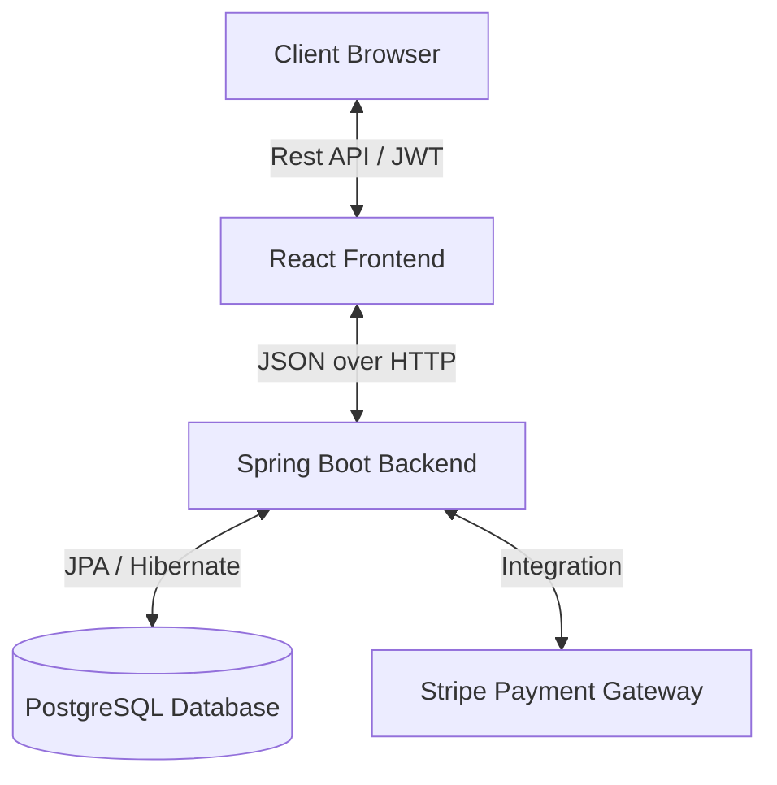

# E-Commerce Banking-Grade Platform

A robust, full-stack E-Commerce application architected with Financial Technology (Fintech) standards. Features a complete Wallet System, Transactional Integrity, and Audit Logging similar to real-world banking applications.


## Architecture



## Key Features (Banking Mindset)

*   **Transactional Integrity**: Critical flows (Order Placement, Wallet Debit) are wrapped in `@Transactional` to ensure data consistency.
*   **Concurrency Control**: Uses `PESSIMISTIC_WRITE` Locking to prevent Double Spending (race conditions).
*   **Audit Logging**: Every wallet movement needs a corresponding `WalletTransaction` record for reconciliation.
*   **Safety**: Validations (`@DecimalMin`, `@NotNull`) ensuring no negative balances or invalid amounts.

## Quick Start

### Backend (Port 8080)
```bash
cd e-com
mvn spring-boot:run
```

### Frontend (Port 5173)
```bash
cd ecom-frontend
npm install
npm run dev
```

## Key API Endpoints

| Method | Endpoint | Description |
| :--- | :--- | :--- |
| `POST` | `/api/auth/signin` | Login & Get JWT |
| `GET` | `/api/public/products` | Browse Products |
| `GET` | `/api/wallet` | Check Balance |
| `POST` | `/api/order/users/payments/WALLET` | Pay with Wallet (Transactional) |

## Screenshots
*   [Login Page](file:///C:/Users/USER/.gemini/antigravity/brain/17d9f503-dcff-4a58-9bb5-0f755075babb/login_page_showcase_1768403364535.png)

## Admin Credentials
*   **Username**: `admin1`
*   **Password**: `123456`
